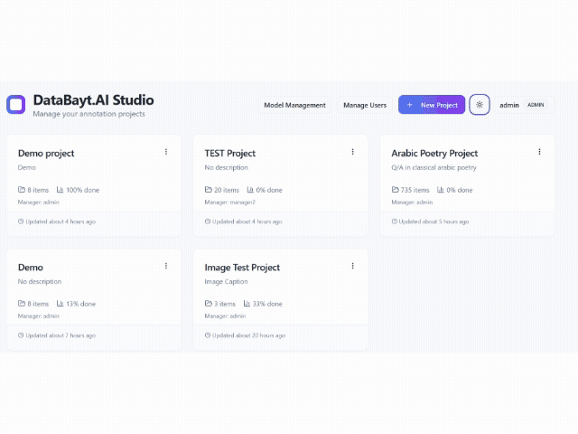

# Tawjeeh Qalam

[](LICENSE)
[](https://nodejs.org)
[](https://react.dev)
[](https://sqlite.org)
[](README.md)

**Self-hosted · AI-assisted · Team-ready**

A professional, fully self-hosted data annotation platform — built for teams who want **full ownership** of their labeling pipeline, AI-assisted workflows, and quality assurance tooling.



---

## Why Tawjeeh Qalam?

> Annotation tools shouldn't lock your data into a cloud you don't control.

Tawjeeh Qalam gives your team a complete annotation environment — with AI-assisted labeling, inter-annotator agreement tracking, role-based access, and bilingual (Arabic/English) support — running entirely on your own infrastructure.

---

## Feature Highlights

### Annotation Workspace

| Capability | Details |
| --- | --- |
| **Upload formats** | JSON, CSV, TXT, Hugging Face datasets |
| **Annotation modes** | Record view · List view with filters |
| **AI assistance** | Accept / Edit / Reject loop with confidence scores |
| **Custom forms** | XML-based config or visual drag-and-drop builder |
| **Keyboard shortcuts** | Full shortcut set + in-app reference panel |
| **Comments** | Threaded comments per data point |
| **Undo / Redo** | Full edit history within a session |

### AI & Model Management

- Connect any provider: **OpenAI, Anthropic, OpenRouter, SambaNova, Ollama (local)**
- Build **model profiles** (prompt, temperature, max tokens, pricing)
- Set per-project **allowed/default profiles** via model policies
- **Token estimation** and cost-aware batch processing
- **Hugging Face** dataset import and private repo publishing

### Team Collaboration

- **Role-based access**: `admin` · `manager` · `annotator`
- **Invite-link onboarding** with expiry, max-use limits, and role presets
- **In-app notifications** with deep-link navigation
- **Audit log** for uploads, AI runs, exports, and assignments
- **Version history** — snapshot and restore any project state
- **Annotation guidelines** — rich Markdown, always one click away

### Quality Assurance

- **Inter-Annotator Agreement (IAA)** — configurable sampling rate and annotator count
- **IAA Dashboard** — per-item agreement scores with adjustable threshold slider
- **Annotator Stats** — speed, edit rate, rejection rate, agreement breakdown
- **Quality charts** — speed-by-annotator bar chart and per-annotator breakdown table

### Bilingual Interface

- Full **Arabic** and **English** UI — every string, label, and message
- **RTL layout** switching with Cairo font for crisp Arabic rendering
- Language preference persisted in `localStorage`
- Relative dates localized (`date-fns` Arabic locale)

### Security

- **JWT authentication** (8 h expiry, stored in `sessionStorage`)
- **bcrypt** password hashing (rounds = 12), transparent migration from legacy plaintext
- `helmet` security headers + login **rate limiting** (10 req / 15 min)
- API keys **masked** in all client responses
- CORS configurable via `ALLOWED_ORIGINS`

---

## Tech Stack

| Layer | Technology |
| --- | --- |
| Frontend | React 18 · TypeScript · Vite · Tailwind CSS · shadcn/ui |
| Backend | Express 5 (ESM) · Node.js ≥ 18 |
| Database | SQLite via `better-sqlite3` (WAL mode) |
| Auth | `jsonwebtoken` · `bcryptjs` |
| AI Providers | OpenAI · Anthropic · OpenRouter · SambaNova · Ollama |
| i18n | i18next · react-i18next · i18next-browser-languagedetector |
| Extras | `driver.js` · `js-tiktoken` · `@huggingface/hub` |

---

## Quick Start

### Prerequisites

- **Node.js 18+**

### 1 — Install dependencies

```bash
npm install
```

### 2 — Configure environment

```bash
cp .env.example .env
```

```env
# Required
JWT_SECRET=your-random-secret-at-least-32-chars

# Optional
PORT=3000
DATA_DIR=server/data
ALLOWED_ORIGINS=http://localhost:8080
```

> The server will warn on startup if `JWT_SECRET` is missing. Always set it in production.

### 3 — Run

```bash
npm run dev:all
```

Frontend: `http://localhost:8080` · Backend: `http://localhost:3000`

### Default credentials

| Username | Password | Note |
| --- | --- | --- |
| `admin` | `admin` | Password change required on first login |

---

## Guided Onboarding

Every new user gets:

- An **interactive tutorial** (dashboard + workspace) powered by driver.js — deferred until after forced password change
- A **demo practice project** (sentiment analysis, 10 pre-labeled samples) to explore the workspace immediately

---

## Project Structure

```text
src/
├── components/
│   ├── DataLabelingWorkspace.tsx   # Main annotation workspace
│   ├── FormBuilder.tsx             # Visual annotation form builder
│   ├── DynamicAnnotationForm.tsx   # Runtime form renderer
│   ├── NotificationBell.tsx        # In-app notifications
│   ├── VersionHistory.tsx          # Snapshot & restore
│   ├── TemplatePickerModal.tsx     # Built-in + custom templates
│   ├── qa/
│   │   ├── AnnotationQualityDashboard.tsx
│   │   └── IAADashboard.tsx
│   └── Tutorial/
│       ├── tourSteps.ts            # Dashboard & workspace tour steps
│       └── useTutorial.ts
├── pages/
│   ├── Dashboard.tsx               # Projects, user management, login
│   ├── ModelManagement.tsx         # Providers, profiles, policies
│   └── ProjectSettings.tsx
├── contexts/
│   ├── AuthContext.tsx
│   └── LanguageContext.tsx         # RTL/LTR + language switching
├── i18n/
│   ├── index.ts                    # i18next configuration
│   └── locales/
│       ├── en.json                 # English strings
│       └── ar.json                 # Arabic strings
└── services/
    ├── apiClient.ts
    ├── xmlConfigService.ts
    └── exportService.ts

server/
├── index.js                        # Express app + middleware
├── middleware/auth.js               # JWT verify, requireAuth, requireRole
├── routes/
│   ├── projects.js                 # Projects, data points, snapshots, audit
│   ├── users.js                    # Auth, user CRUD, invite tokens
│   └── models.js                   # Connections, profiles, policies
└── services/
    ├── database.js                 # SQLite schema, migrations, seed
    └── notificationService.js
```

---

## Access Control

| Role | Capabilities |
| --- | --- |
| `admin` | Full access — users, all projects, model management |
| `manager` | Manage assigned projects, annotator assignments, model management |
| `annotator` | Access only assigned projects; annotate data |

---

## Data Formats

| Format | Behavior |
| --- | --- |
| **CSV** | All columns preserved as metadata; choose display columns in workspace |
| **JSON** | Flexible payloads — text and image-style records supported |
| **TXT** | Each line becomes a separate annotation item |
| **Hugging Face** | Browse and import public datasets directly from the workspace |

---

## Deployment

```bash
# Build frontend
npm run build

# Start production server
npm start
```

- Serve the `dist/` folder as static files from the same Express process or a reverse proxy (nginx).
- Set `JWT_SECRET` to a strong random value: `openssl rand -hex 32`
- SQLite database is created at `server/data/databayt.sqlite` — override with `DATA_DIR`.
- All provider API keys are stored server-side and never exposed in full to clients.

---

## Troubleshooting

### Provider / model list not loading

- Confirm backend is running: `npm run dev:all`
- Verify API key in **Model Management → Connections**
- Check browser Network tab for proxy route errors (`/api/openai/*`, etc.)

### Upload issues

- Confirm file is valid JSON / CSV / TXT
- For CSV, ensure column headers are present in the first row

### AI processing errors

- Verify the model profile has an active provider connection
- Check API key credits / rate limits
- For Ollama, confirm the endpoint is reachable: `http://localhost:11434`

### Access denied on project or model pages

- Confirm the user's role and project assignment in **User Management**

### 401 after server restart

- `sessionStorage` tokens are tab-scoped and do not survive a browser session restart — simply log in again

---

## License

This project is licensed under the **GNU Affero General Public License v3.0 (AGPL-3.0)**.

You are free to use, modify, and distribute this software under the terms of the AGPL-3.0. Any modified version deployed as a network service must also be made available under the same license.

See the [LICENSE](LICENSE) file for full details.

---

Built with care by the **Tawjeeh Qalam** team.
